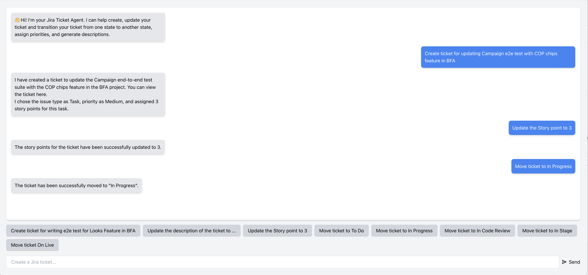

# JIRA AI Agent with Langchain

JIRA AI Agent is a comprehensive solution designed to automate the process of managing, creating, updating JIRA tickets using OpenAI's language model enhanced with Langchain Framework using Typescript. The agent maintains conversational memory, enabling seamless follow-ups without referencing past tickets. It intelligently identifies the appropriate JIRA board, sprint, and leverages thread-based chat histories to manage interactions for different clients. This streamlines ticket creation, improves efficiency, and reduces manual effort.




## Table of Contents

- [Features](#features)
- [Getting Started](#getting-started)
  - [Prerequisites](#prerequisites)
  - [Installation](#installation)
  - [Environment Variables](#environment-variables)
- [Running the Project](#running-the-project)
- [Scripts](#scripts)
- [Project Structure](#project-structure)
- [Contributing](#contributing)
- [License](#license)

## Features

- **Automated Ticket Creation**: Generates JIRA tickets based on user prompts.
- **Automated Ticket Updating**: Updates JIRA tickets based on user prompts.
- **Automated Ticket Transition**: Move ticket from one status to other for eg. To do -> In Progress based on user prompts.
- **Conversational Memory**: Retains context of previous interactions, eliminating the need to reference past tickets in follow-up queries.
- **Multi-User Support with Threads**: Manages isolated chat histories for different users/clients using thread-based conversations.
- **AI-Powered Summarization**: Utilizes OpenAI LLM to create concise ticket summaries.
- **Priority and Story Point Estimation**:  Utilizes OpenAI LLM to assesses and assigns priority levels and story points.
- **Intelligent Board and Sprint Assignment**: Identifies the relevant JIRA board id and current sprint for the new ticket based on prompt.
- **Full-Stack Application**: Built with a TypeScript React frontend and a Node.js backend, styled using Tailwind CSS.

## Getting Started

Follow these instructions to set up and run the JIRA AI Agent on your local machine.

### Prerequisites

- **Node.js**: Ensure you have Node.js installed. Download it from [nodejs.org](https://nodejs.org/).
- **pnpm**: Install pnpm globally using npm:

  ```bash
  npm install -g pnpm

### Installation
1. **Clone the Repository**:
   ```bash
   git clone https://github.com/rehmat123/Jira-agent.git
   cd Jira-agent

2. **Install Dependencies**:
Navigate to both the frontend and backend directories and install the required packages:
    ```bash
    pnpm install -- on root level
    cd backend
    pnpm install
### Environment Variables
Create a `.env` file in root level directories. Use the `.env.example` files as templates to configure your environment variables.

## Running the Project
### Start the Backend and frontend Server Concurently
In the root level, run:
```bash
pnpm start
```
Access the frontend at http://localhost:3001 and the backend at http://localhost:5001.


### Technical Enhancements
Langchain Integration: Orchestrates AI workflows for dynamic ticket generation and context-aware responses.

Thread Management: Uses threads to isolate chat histories, enabling multi-user support without data overlap.

Memory Mangament: Save long term memory that is utilize with each new user prompt


### Scripts

- `pnpm start`: Runs both frontend and backend application in development mode concurrently
- `pnpm build`: Builds the application for production.
- `pnpm test`: Runs the test suite.


## Project Structure
The project is divided into two main directories:
- `src`: Contains the React application built with TypeScript and styled using Tailwind CSS.
- `backend`: Houses the Node.js server that interfaces with JIRA and OpenAI APIs.

## Contributing
Contributions are welcome! Please follow these steps:
1. Fork the repository
2. Create your feature branch (`git checkout -b feature/AmazingFeature`)
3. Commit your changes (`git commit -m 'Add some AmazingFeature'`)
4. Push to the branch (`git push origin feature/AmazingFeature`)
5. Open a Pull Request

Please ensure that your code adheres to the project's coding standards and includes appropriate tests.

## License
This project is licensed under the MIT License. See the `LICENSE` file for more details.